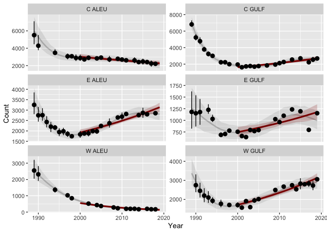

<!-- README.md is generated from README.Rmd. Please edit that file -->
<!-- [](https://travis-ci.org/NMML/crawl) -->

## Installation

``` r
require(remotes)
#> Loading required package: remotes
remotes::install_github("dsjohnson/agTrend.ssl")
#> Skipping install of 'agTrend.ssl' from a github remote, the SHA1 (e8c4a264) has not changed since last install.
#>   Use `force = TRUE` to force installation
```

## Fit regional trends to site-specific abundence data

This package fits a log-linear trend models to regions aggregated over
sites. The sites may contain missing surveys that are not temporally
aligned with the missing data at other sites, making direct aggregation
impossible. The functions within the package model the individual sites
with a semi-parametric model to interpolate missing data from which
regional aggregations can be made. By using penalized generalized
additive models via the `R` package `mgcv`, on can sample from the
approximate posterior predictive distribution of the regional
aggregations, then calculate the log-linear trend over the time period
of interest as a derived parameter. Using the posterior predictive
distribution allows incorporation of both parameter uncertainty as well
as uncertainty due to sampling the local abundance processes.

## Disclaimer

*This software package is developed and maintained by scientists at the
NOAA Fisheries Alaska Fisheries Science Center and should be considered
a fundamental research communication. The recommendations and
conclusions presented here are those of the authors and this software
should not be construed as official communication by NMFS, NOAA, or the
U.S. Dept. of Commerce. In addition, reference to trade names does not
imply endorsement by the National Marine Fisheries Service, NOAA. While
the best efforts have been made to insure the highest quality, tools
such as this are under constant development and are subject to change.*

## agTrend.ssl Model

The model used by `agTrend.ssl` for imputing missing data is slightly
different than the original `agTrend` model. Specifically, in
`agTrend.ssl`, the sea lion count,
 for
site  and year
 is modeled with the
Tweedie distribution

.")

The mean and variance of Tweedie distribution is
 and

respectively. So, there is an automatic adjustment for overdispersion of
the counts, if it is present. In `agTrend.ssl`, by default, the mean
function,

 + f_s(t),
")

is modeled with a hierarchical GAM model with an overall time smooth and
a site-specific time smooth. The wiggliness of the smooths are penalized
with parameters

and
.
Note, there is one parameter penalizing the site-specific smooths. So
they will all have the same degree of smoothness. The power parameter is
modeled with a site-specific random effect

 = \beta_{p,0} + \epsilon_{p,s};\ \ \epsilon_{s} \sim N(0,\tau_p^2),
")

The link function enforces the constraint
.
The same basic model is used for
 as well,

.
")

These random effect models allow site-specific power and dispersion
parameters, but there is a soft constraint to be similar to one another.

Often, the default model is too rich for the data set (i.e., there are
too man parameters), so the model can be adjusted to allow fitting.
There are examples for both ages and regions
(<https://github.com/dsjohnson/agTrend.ssl/tree/master/examples>). The
example in the next section illustrates using an adjusted model
statement.

## Analysis of wDPS pup trends

### Reading and processing data

``` r
library(agTrend.ssl)
library(tidyverse)
library(readxl)
library(ggplot2)

### read in ALLCOUNTS file and process it. Sites are filtered out that had
### less than 2 surveys or less than 2 positive counts.
wdpspup <- agTrend.ssl::proc.data(allcounts="ALLCOUNTS_v8.xlsx", age="pup", dps="wdps") %>%
  mutate(region=factor(region)) %>% filter(n.survey>1, n.nonzero>1)

### Get site information
site.info <- wdpspup %>% select(site, region, rca) %>% distinct()
```

### Model fitting

First we try the default model:

``` r
fit <- agTrend.ssl::fit.gam(data=wdpspup, obl.corr=FALSE)
#> Error in gam(mod, data = data, family = twlss(), select = TRUE): Model has more coefficients than data
```

The `obl.corr` argument tells the function whether to use oblique photo
correction or not. If `obl.corr=TRUE`, there needs to be a column in the
data labeled `obl` with 1s for oblique photo surveys and 0s for vertical
photo surveys, then an offset of -0.04 is used to reduce the expected
counts of oblique photos by about 4%. If you fit this model for the wDPS
pup data, however, you see that you will get the error:
`Error in gam(mod, data = data, family = twlss(), select = TRUE) : Model has more coefficients than data`.
This is because the default model has too many degrees of freedom for
the number of count surveys observed. So, we can alter the default model
by reducing the degrees of freedom `mgcv` uses for fitting the mean
portion of the hierarchical GAM model.

``` r
fit <- agTrend.ssl::fit.gam(data=wdpspup, obl.corr=FALSE,
                            alt.mod=list(
                              mu.form = count ~  s(year, k=8) + s(year, site, bs="fs", k=8),
                              p.form=~s(site, bs='re'), phi.form=~s(site, bs='re')
                            ))
```

The default for `mgcv::gam` is to use `k=10` (I believe), so reducing it
to `k=8` reduces the number of coefficients by about 2 + 72 \* 2 = 146.
Other models can be specified for the variance parameters as well. For
example, with the pup analysis in eDPS, random effects were based on
regions (e.g., SE AK, BC, WA, etc…) by using,
`p.form = ~s(region, bs='re')`.

### Sample missing values using the fitted model

Now that the imputation model is fitted, we can sample missing values
from an approximated posterior distribution. The `ag.summary(...)`
function will summarize the sample for each site. Here I am only drawing
1,000 samples for a real analysis I would probably use `size=10000`.

``` r
N <- sample.abund(fit, wdpspup, yrs=1989:2019, size=1000, add.site.data=site.info)
N.summ <- ag.summary(N, ci.prob=0.9)
head(N)
#> # A tibble: 6 x 7
#>   site        data          surv.times N.pred         N.real        region   rca
#>   <chr>       <list>        <list>     <list>         <list>        <fct>  <dbl>
#> 1 ADAK/LAKE … <tibble[,2] … <int [10]> <dbl[,31] [1,… <dbl[,31] [1… C ALEU     4
#> 2 ADUGAK      <tibble[,2] … <int [13]> <dbl[,31] [1,… <dbl[,31] [1… E ALEU     6
#> 3 AGATTU      <tibble[,2] … <int [15]> <dbl[,31] [1,… <dbl[,31] [1… W ALEU     1
#> 4 AGLIGADAK   <tibble[,2] … <int [9]>  <dbl[,31] [1,… <dbl[,31] [1… C ALEU     5
#> 5 AIKTAK      <tibble[,2] … <int [9]>  <dbl[,31] [1,… <dbl[,31] [1… E ALEU     6
#> 6 AKUN/BILLI… <tibble[,2] … <int [14]> <dbl[,31] [1,… <dbl[,31] [1… E ALEU     6
head(N.summ)
#> # A tibble: 6 x 13
#>   site      year count region   rca est.pred se.pred ci.pred.lower ci.pred.upper
#>   <chr>    <int> <dbl> <fct>  <dbl>    <dbl>   <dbl>         <dbl>         <dbl>
#> 1 ADAK/LA…  1989    NA C ALEU     4     331.    92.8          201.          488.
#> 2 ADAK/LA…  1990   137 C ALEU     4     310.    84.7          170.          446.
#> 3 ADAK/LA…  1991    NA C ALEU     4     286.    81.6          166.          416.
#> 4 ADAK/LA…  1992    NA C ALEU     4     274.    81.3          156.          410.
#> 5 ADAK/LA…  1993    NA C ALEU     4     271.    80.0          155.          410.
#> 6 ADAK/LA…  1994   327 C ALEU     4     267.    72.8          162.          388.
#> # … with 4 more variables: est.real <dbl>, se.real <dbl>, ci.real.lower <dbl>,
#> #   ci.real.upper <dbl>
```

We can then aggregate the imputed counts and estimate trends for regions
such as the region designations. Here is the predicted and realized
trends for the regions of the wDPS from 2000-2019:

``` r
reg.N <- ag.abund(N, 'region')
reg.summ <- ag.summary(reg.N)
reg.tr <- ag.trend(reg.N, timeframe=c(2000,2019), ci.prob=0.95)

reg.tr$growth %>% arrange(type, region)
#> # A tibble: 12 x 5
#>    region type        Est lower  upper
#>    <fct>  <chr>     <dbl> <dbl>  <dbl>
#>  1 C ALEU predicted -1.50 -2.47 -0.324
#>  2 C GULF predicted  2.61  1.85  3.49 
#>  3 E ALEU predicted  2.59  1.93  3.24 
#>  4 E GULF predicted  2.42  1.26  3.75 
#>  5 W ALEU predicted -7.07 -7.75 -6.31 
#>  6 W GULF predicted  3.21  2.41  3.90 
#>  7 C ALEU realized  -1.46 -2.27 -0.678
#>  8 C GULF realized   2.66  2.25  3.14 
#>  9 E ALEU realized   2.63  2.22  3.08 
#> 10 E GULF realized   2.66  2.08  3.14 
#> 11 W ALEU realized  -7.06 -7.63 -6.61 
#> 12 W GULF realized   3.33  3.00  3.67
```

Here’s plot of those trends.

``` r
ggplot(data=reg.summ) +
  geom_ribbon(aes(x=year, ymin=ci.pred.lower, ymax=ci.pred.upper), alpha=0.1) +
  geom_path(aes(x=year, y=est.pred), alpha=0.2, lwd=1) +
  geom_path(aes(x=year, y=Est), data=reg.tr$fitted %>% filter(type=='predicted'), color='darkred', lwd=1.2) +
  geom_ribbon(aes(x=year, ymin=lower, ymax=upper), reg.tr$fitted %>% filter(type=='predicted'), alpha=0.2, fill='darkred') +
  geom_pointrange(aes(x=year, y=est.real, ymin=ci.real.lower, ymax=ci.real.upper), data=reg.summ %>% filter(surveyed==1)) +
  xlab('Year') + ylab('Count') + facet_wrap(~region, nrow=3, scale='free_y')
```

<!-- -->
